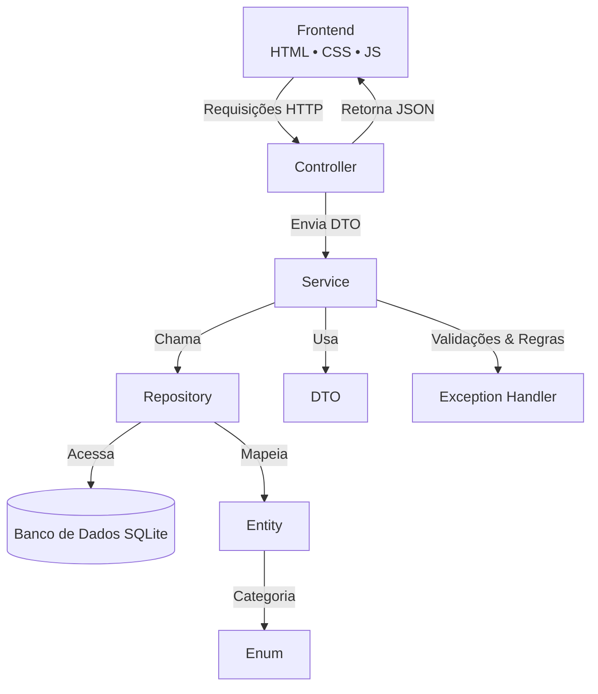

# 🛒 Mini E-commerce - Sistema de Gerenciamento de Produtos

## 📖 Descrição
Este projeto é um **mini e-commerce** desenvolvido em **Java 21** com **Spring Boot**, integrando **SQLite** como banco de dados e um **frontend simples em HTML, CSS e JavaScript**.  

O objetivo é permitir o gerenciamento de produtos com operações **CRUD completas**, além de cálculos úteis sobre estoque e valor total armazenado.

---

## 📦 Recurso: Produto
Cada produto é armazenado no banco de dados com os seguintes atributos:

| Campo         | Tipo         | Obrigatório | Descrição |
|---------------|-------------|-------------|-----------|
| `id`          | Long (PK)   | Sim | Identificador único |
| `nome`        | String (100) | Sim | Nome do produto |
| `preco`       | Double      | Sim | Preço do produto (maior que zero) |
| `categoria`   | Enum        | Sim | Categoria (ex.: ROUPA, ELETRONICO, ALIMENTO) |
| `estoque`     | Integer     | Sim | Quantidade em estoque (≥ 0) |
| `dataEntrada` | LocalDate   | Sim | Data de entrada no estoque |
| `descricao`   | String (500)| Não | Descrição opcional |
| `imagemUrl`   | String (255)| Não | URL da imagem do produto |

---

## ⚙️ Funcionalidades
A aplicação implementa um **serviço de produtos** com as seguintes operações:

- `listarTodos()` → Lista todos os produtos.
- `buscarPorId(Long id)` → Busca produto pelo ID.
- `buscarPorCategoria(Categoria categoria)` → Busca produtos filtrando pela categoria.
- `buscarPorNome(String nome)` → Busca produtos pelo nome exato.
- `buscarPorTermo(String termo)` → Busca produtos contendo um termo no nome ou descrição.
- `criar(CriarProdutoDTO produtoDTO)` → Cria um novo produto.
- `atualizar(Long id, AtualizarProdutoDTO produtoDTO)` → Atualiza os dados de um produto existente.
- `excluir(Long id)` → Remove um produto do banco.
- `contarTotalProdutos()` → Retorna a quantidade total de produtos cadastrados.
- `contarTotalEstoque()` → Retorna o estoque total (somatória de quantidades).
- `calcularValorTotalEstoque()` → Calcula o valor total do estoque (quantidade × preço).

---

## 🗄️ Banco de Dados

### Script SQL (SQLite)
```sql
CREATE TABLE produto (
    id INTEGER PRIMARY KEY AUTOINCREMENT,
    nome VARCHAR(100) NOT NULL,
    preco DOUBLE NOT NULL CHECK (preco > 0),
    categoria VARCHAR(20) NOT NULL,
    estoque INTEGER NOT NULL CHECK (estoque >= 0),
    data_entrada DATE NOT NULL,
    descricao VARCHAR(500),
    imagem_url VARCHAR(255)
);
````

---

## 🏗️ Arquitetura do Projeto

O projeto segue uma arquitetura em camadas organizada em pacotes:

* **`entity`** → Contém as entidades do sistema, que representam as tabelas do banco de dados (ex.: `Produto`).
* **`config`** → Armazena configurações globais do Spring Boot, banco de dados e outros beans que precisam ser gerenciados.
* **`controller`** → Contém os controladores REST (`ProdutoController`) responsáveis por receber as requisições HTTP e devolver respostas para o cliente.
* **`dto`** → Define os *Data Transfer Objects*, usados para transferir dados entre camadas (ex.: `ProdutoDTO`, `CriarProdutoDTO`, `AtualizarProdutoDTO`).
* **`enum`** → Enumerações que representam constantes, como a `Categoria` de um produto.
* **`exception`** → Tratamento de exceções personalizadas, garantindo respostas claras e padronizadas em caso de erro.
* **`repository`** → Interfaces que herdam de `JpaRepository`, responsáveis por acessar e manipular o banco de dados (ex.: `ProdutoRepository`).
* **`service`** → Contém as regras de negócio e integra as camadas de controller e repository (ex.: `ProdutoService` e sua implementação).

Essa separação garante **organização, manutenibilidade e escalabilidade** do sistema.

---

## 🔎 Diagrama da Arquitetura



---

## 🎨 Interface do Sistema

### 📌 Lista de Produtos


Tela onde o usuário pode visualizar todos os produtos cadastrados, com opção de **editar**, **excluir**, aplicar **filtros** por nome, categoria, preço e estoque.

---

### 📌 Cadastro de Produtos

  
Tela para cadastrar novos produtos no sistema, com campos obrigatórios como **nome, preço, categoria, estoque e data de entrada**.

---

### 📌 Dashboard

  
Tela com visão geral do sistema, mostrando indicadores como **total de produtos, quantidade em estoque e valor total do inventário**.

---

## ⚙️ Tecnologias e Dependências

### **Backend**

* **Java 21** → Linguagem principal.
* **Spring Boot 3.2.4**

  * `spring-boot-starter-web` → Suporte a APIs REST e servidor embutido (Tomcat).
  * `spring-boot-starter-data-jpa` → Integração com JPA/Hibernate para persistência no banco.
  * `spring-boot-starter-validation` → Validações automáticas via anotações (`@NotBlank`, `@Min`, etc.).
* **Lombok** → Reduz boilerplate (getters, setters, builders).
* **SQLite JDBC (`org.xerial`)** → Driver para conexão com SQLite.
* **Hibernate Community Dialects** → Suporte a dialetos SQL, incluindo SQLite.

### **Frontend**

* **HTML5, CSS3 e JavaScript** → Interface simples para interação com o sistema.

### **Testes**

* `spring-boot-starter-test` → Frameworks de teste (JUnit, Mockito, etc.).

---

## 🚀 Como Executar o Projeto

### 1️⃣ Pré-requisitos

* Java 21 instalado
* Maven configurado
* SQLite instalado (ou usar JDBC embutido)

### 2️⃣ Clonar o Repositório

```bash
git clone https://github.com/Paulooassis/Projeto-DTI.git
cd mini-ecommerce
```

### 3️⃣ Instalar Dependências

```bash
mvn clean install
```

### 4️⃣ Executar a Aplicação

```bash
mvn spring-boot:run
```

### 5️⃣ Acessar

* API: `http://localhost:8080/api/produtos`
* Frontend: abrir `index.html` na pasta do frontend.

---

## ✅ Diferenciais

* 🔍 Busca avançada por **nome** e **termo parcial**
* 📊 Funções de **contagem e cálculo de valor de estoque**
* 🧪 Testes automatizados com Spring Boot Test (JUnit/Mockito)
* 🐳 Possibilidade de conteinerização com **Docker**


