# 🛒 Mini E-commerce - Sistema de Gerenciamento de Produtos

## 📖 Descrição
Este projeto é um **mini e-commerce** desenvolvido em **Java 21** com **Spring Boot**, integrando **SQLite** como banco de dados e um **frontend simples em HTML, CSS e JavaScript**.  

O objetivo é permitir o gerenciamento de produtos com operações **CRUD completas**, além de cálculos úteis sobre estoque e valor total armazenado.

---

## 📦 Recurso: Produto
Cada produto é armazenado no banco de dados com os seguintes atributos:

| Campo         | Tipo         | Obrigatório | Descrição |
|---------------|-------------|-------------|-----------|
| `id`          | Long (PK)   | Sim | Identificador único |
| `nome`        | String (100) | Sim | Nome do produto |
| `preco`       | Double      | Sim | Preço do produto (maior que zero) |
| `categoria`   | Enum        | Sim | Categoria (ex.: ROUPA, ELETRONICO, ALIMENTO) |
| `estoque`     | Integer     | Sim | Quantidade em estoque (≥ 0) |
| `dataEntrada` | LocalDate   | Sim | Data de entrada no estoque |
| `descricao`   | String (500)| Não | Descrição opcional |
| `imagemUrl`   | String (255)| Não | URL da imagem do produto |

---

## ⚙️ Funcionalidades
A aplicação implementa um **serviço de produtos** com as seguintes operações:

- `listarTodos()` → Lista todos os produtos.
- `buscarPorId(Long id)` → Busca produto pelo ID.
- `buscarPorCategoria(Categoria categoria)` → Busca produtos filtrando pela categoria.
- `buscarPorNome(String nome)` → Busca produtos pelo nome exato.
- `buscarPorTermo(String termo)` → Busca produtos contendo um termo no nome ou descrição.
- `criar(CriarProdutoDTO produtoDTO)` → Cria um novo produto.
- `atualizar(Long id, AtualizarProdutoDTO produtoDTO)` → Atualiza os dados de um produto existente.
- `excluir(Long id)` → Remove um produto do banco.
- `contarTotalProdutos()` → Retorna a quantidade total de produtos cadastrados.
- `contarTotalEstoque()` → Retorna o estoque total (somatória de quantidades).
- `calcularValorTotalEstoque()` → Calcula o valor total do estoque (quantidade × preço).

---

## 🗄️ Banco de Dados

### Script SQL (SQLite)
```sql
CREATE TABLE produto (
    id INTEGER PRIMARY KEY AUTOINCREMENT,
    nome VARCHAR(100) NOT NULL,
    preco DOUBLE NOT NULL CHECK (preco > 0),
    categoria VARCHAR(20) NOT NULL,
    estoque INTEGER NOT NULL CHECK (estoque >= 0),
    data_entrada DATE NOT NULL,
    descricao VARCHAR(500),
    imagem_url VARCHAR(255)
);
````

---

## 🏗️ Arquitetura do Projeto

O projeto segue uma arquitetura em camadas organizada em pacotes:

* **`entity`** → Contém as entidades do sistema, que representam as tabelas do banco de dados (ex.: `Produto`).
* **`config`** → Armazena configurações globais do Spring Boot, banco de dados e outros beans que precisam ser gerenciados.
* **`controller`** → Contém os controladores REST (`ProdutoController`) responsáveis por receber as requisições HTTP e devolver respostas para o cliente.
* **`dto`** → Define os *Data Transfer Objects*, usados para transferir dados entre camadas (ex.: `ProdutoDTO`, `CriarProdutoDTO`, `AtualizarProdutoDTO`).
* **`enum`** → Enumerações que representam constantes, como a `Categoria` de um produto.
* **`exception`** → Tratamento de exceções personalizadas, garantindo respostas claras e padronizadas em caso de erro.
* **`repository`** → Interfaces que herdam de `JpaRepository`, responsáveis por acessar e manipular o banco de dados (ex.: `ProdutoRepository`).
* **`service`** → Contém as regras de negócio e integra as camadas de controller e repository (ex.: `ProdutoService` e sua implementação).

Essa separação garante **organização, manutenibilidade e escalabilidade** do sistema.

---

## 🔎 Diagrama da Arquitetura

```mermaid
flowchart TD
    A[Frontend<br>HTML • CSS • JS] -->|Requisições HTTP| B[Controller]
    B -->|Envia DTO| C[Service]
    C -->|Chama| D[Repository]
    D -->|Acessa| E[(Banco de Dados SQLite)]

    C -->|Usa| F[DTO]
    B -->|Retorna JSON| A
    D -->|Mapeia| G[Entity]
    C -->|Validações & Regras| H[Exception Handler]
    G -->|Categoria| I[Enum]
```



---

## 🎨 Interface do Sistema

### 📌 Lista de Produtos


Tela onde o usuário pode visualizar todos os produtos cadastrados, com opção de **editar**, **excluir**, aplicar **filtros** por nome, categoria, preço e estoque.

---

### 📌 Cadastro de Produtos

  
Tela para cadastrar novos produtos no sistema, com campos obrigatórios como **nome, preço, categoria, estoque e data de entrada**, e optativos o campo descrição e anexar imagem que estão um pouco abaixo(não coube no print).

---

### 📌 Dashboard

  
Tela com visão geral do sistema, mostrando indicadores como **total de produtos, quantidade em estoque e valor total do inventário**.

---

## ⚙️ Tecnologias e Dependências

### **Backend**

* **Java 21** → Linguagem principal.
* **Spring Boot 3.2.4**

  * `spring-boot-starter-web` → Suporte a APIs REST e servidor embutido (Tomcat).
  * `spring-boot-starter-data-jpa` → Integração com JPA/Hibernate para persistência no banco.
  * `spring-boot-starter-validation` → Validações automáticas via anotações (`@NotBlank`, `@Min`, etc.).
* **Lombok** → Reduz boilerplate (getters, setters, builders).
* **SQLite JDBC (`org.xerial`)** → Driver para conexão com SQLite.
* **Hibernate Community Dialects** → Suporte a dialetos SQL, incluindo SQLite.

### **Frontend**

* **HTML5, CSS3 e JavaScript** → Interface simples para interação com o sistema.

### **Testes**

* `spring-boot-starter-test` → Frameworks de teste (JUnit, Mockito, etc.).

---

## 🚀 Como Executar o Projeto

### 1️⃣ Pré-requisitos

* Java 21 instalado
* Maven configurado
* SQLite instalado (ou usar JDBC embutido)

### 2️⃣ Clonar o Repositório

```bash
git clone https://github.com/Paulooassis/Projeto-DTI.git
cd mini-ecommerce
```

### 3️⃣ Instalar Dependências

```bash
mvn clean install
```

### 4️⃣ Executar a Aplicação

```bash
mvn spring-boot:run
```

### 5️⃣ Acessar

* API: `http://localhost:8080/api/produtos`
* Frontend: abrir `index.html` na pasta do frontend.

---

## ✅ Diferenciais

* 🔍 Busca avançada por **nome** e **termo parcial**
* 📊 Funções de **contagem e cálculo de valor de estoque**
* 🧪 Testes automatizados com Spring Boot Test (JUnit/Mockito)
* 🐳 Possibilidade de conteinerização com **Docker**


## 📝 Logs e Testes Unitários na Controller

A classe **`ProdutoController`** é responsável por receber as requisições HTTP da API e interagir com a camada de serviço. Para garantir **rastreamento e confiabilidade**, foram adicionados **logs** em cada operação:

* **INFO** → usado para registrar ações principais (ex.: criação, busca, exclusão de produtos).
* **ERROR** → utilizado para capturar e descrever erros ocorridos durante as requisições.

Exemplo de log no método de criação:

```java
logger.info("POST /api/produtos - Criando novo produto: {}", produtoDTO.getNome());
logger.error("POST /api/produtos - Erro ao criar produto: {}", e.getMessage(), e);
```

Isso facilita a **auditoria** das requisições e o **debug** em caso de falhas, armazenando mensagens em console ou arquivo de log configurado no `application.properties`.

Além disso, a aplicação conta com **testes unitários (JUnit + Mockito)** que validam tanto os fluxos de sucesso quanto de erro dos serviços.
Esses testes garantem que as regras de negócio funcionam corretamente e que exceções, como *produto não encontrado*, são tratadas de forma adequada.

✅ **Benefícios**:

* Rastreabilidade de operações da API.
* Facilidade na detecção de erros em produção.
* Confiança no código por meio de testes automatizados.


## 🧪 Testes Unitários (`ProdutoServiceImplTest`)

O projeto conta com **testes unitários** implementados em **JUnit 5** com **Mockito**, garantindo que as regras de negócio da camada de serviço funcionem corretamente.

Os testes verificam tanto os **fluxos de sucesso** quanto os **cenários de erro**, assegurando a confiabilidade do sistema.

### 🔹 Cenários Cobertos

* **Listagem de produtos** → valida se retorna todos os itens cadastrados.
* **Busca por ID e categoria** → garante o retorno correto e lança exceção quando o produto não existe.
* **Busca por nome e termo** → verifica consultas parciais e case-insensitive.
* **Criação de produto** → assegura que os dados são persistidos corretamente no repositório.
* **Atualização** → confirma a modificação dos atributos e lança exceção se o produto não for encontrado.
* **Exclusão** → valida se o produto é removido quando existe e se uma exceção é lançada caso não exista.
* **Métricas de estoque** → testa os métodos de contagem de produtos, soma total do estoque e cálculo do valor total armazenado.
* **Conversão para DTO** → garante que os objetos são convertidos corretamente para transferência de dados.

### ✅ Benefícios

* Aumenta a **confiabilidade** do sistema.
* Garante que **erros sejam capturados antecipadamente**.
* Facilita **manutenções futuras**, evitando regressões.
* Melhora a **cobertura de testes** em cenários reais de uso.

